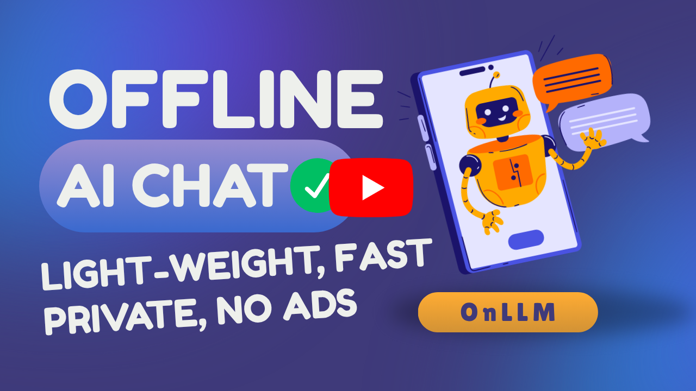

# OnLLM 🧠
OnLLM is the platform to run `Large Language Model` (LLM) or SLM models using `OnnxRuntime` directly on low-end devices like low power computers, mobile phones etc. It is cross-platform using Kivy &amp; open-source.

> The name is derived from: `On` from Onnx + `LLM`. Our approach is always local & offline first (you will need internet to download the model files for the first time). Arificial Intelligence (AI) to be accesible to everyone.

### Features
1. ✅️ An inbuild chatbot to chat with the AI model(s).
2. ✅️ A local offline RAG to query on our selected document (pdf/docx) directly in the chatbot.
2. ✅️ No trackers, no Ads, No data collection, completely Private.

[](https://github.com/daslearning-org/OnLLM/releases)
[](https://www.youtube.com/watch?v=D-KwL59GgKA)

## 📽️ Demo
You can click on the below Image or this [Youtube Link](https://www.youtube.com/watch?v=D-KwL59GgKA) to see the demo. Please let me know in the comments, how do you feel about this App. <br>
[](https://www.youtube.com/watch?v=D-KwL59GgKA)

## 🖧 Our Scematic Architecture
To be added...

## 🧑‍💻 Quickstart Guide

### 📱 Download & Run the Android App
You can check the [Releases](https://github.com/daslearning-org/OnLLM/tags) and downlaod the latest version of the android app (APK file) on your phone.

### 💻 Download & Run the Windows or Linux App
You can check the [Releases](https://github.com/daslearning-org/OnLLM/releases) and downlaod the latest version of the application on your computer. If you are on `Windows`, download the `OnLLM_X.X.X.exe` file & double click to run it. If you are on `Linux`, download `OnLLM_Linux_XXX` file and run it.

#### Notes:
- Some Antivirus softwares might give you detection alert for the exe (happens for PyInstaller apps), you need to add an exception in that case.
- On Linux you may need to change file permission to execute it.
```bash
chmod +x OnLLM_Linux_XXX
./OnLLM_Linux_XXX
```

### 🐍 Run with Python

1. Clone the repo
```bash
git clone https://github.com/daslearning-org/OnLLM.git
```

2. Run the application
```bash
cd OnLLM/app/
pip install -r requirements.txt # virtual environment is recommended
python main.py
```

## 🦾 Build your own App
The Kivy project has a great tool named [Buildozer](https://buildozer.readthedocs.io/en/latest/) which can make mobile apps for `Android` & `iOS`

### 📱 Build Android App
A Linux environment is recommended for the app development. If you are on Windows, you may use `WSL` or any `Virtual Machine`. As of now the `buildozer` tool works on Python version `3.11` at maximum. I am going to use Python `3.11`

#### Install Rust & Add that in path
```bash
curl https://sh.rustup.rs -sSf | sh # then follow the prompt
export PATH="$HOME/.cargo/bin:$PATH"
# optional
rustup default stable
```

#### Install other dependencies & build APK
```bash
# add the python repository
sudo add-apt-repository ppa:deadsnakes/ppa
sudo apt update

# install all dependencies.
sudo apt install -y ant autoconf automake ccache cmake g++ gcc libbz2-dev libffi-dev libltdl-dev libtool libssl-dev lbzip2 make ninja-build openjdk-17-jdk patch patchelf pkg-config protobuf-compiler python3.11 python3.11-venv python3.11-dev

# optionally we can default to python 3.11
sudo ln -sf /usr/bin/python3.11 /usr/bin/python3
sudo ln -sf /usr/bin/python3.11 /usr/bin/python
sudo ln -sf /usr/bin/python3.11-config /usr/bin/python3-config

# optionally you may check the java installation with below commands
java -version
javac -version

# install python modules
git clone https://github.com/daslearning-org/OnLLM.git
cd OnLLM/app/
python3.11 -m venv .env # create python virtual environment
source .env/bin/activate
pip install -r req_android.txt

# build the android apk
buildozer android debug # this may take a good amount of time for the first time & will generate the apk in the bin directory
```

### 🖳 Build Computer Application (Windows / Linux / MacOS)
A `Python` virtual environment is recommended and will use `PyInstaller` to package it.

```bash
# install pyinstaller
git clone https://github.com/daslearning-org/OnLLM.git
cd OnLLM/app/
python3.11 -m venv .env # create python virtual environment
source .env/bin/activate
pip install -r requirements.txt
pip install pyinstaller

# then update the spec file as needed
# then build your app which will be native to the OS i.e. Linux or Windows or MAC
pyinstaller desktopApp.spec
```

## 🔗 LLM Models used in this project

### LLM (QA) models:
The models are being taken from different sources & below are the models available as on today. Size is the compressed size (approax). Few models which are marked with warning (⚠️) symbol may be very slow or unresponsive on `Android` or low power devices.

| Model | Size | Android | Desktop |
| :---- | :--- | :-----: | :-----: |
| [SmolLM2-135M](https://huggingface.co/HuggingFaceTB/SmolLM2-135M-Instruct) | 95MB | ✅️ | ✅️ |
| [SmolLM2-360M](https://huggingface.co/HuggingFaceTB/SmolLM2-360M-Instruct) | 241MB | ✅️ | ✅️ |
| [Gemma3-1B](https://huggingface.co/onnx-community/gemma-3-1b-it-ONNX) | 645MB | ⚠️ | ✅️ |

### Embed models (Document RAG):
It follows the same priciples as above.

| Model | Size | Android | Desktop |
| :---- | :--- | :-----: | :-----: |
| [all-MiniLM-L6-V2](https://huggingface.co/onnx-models/all-MiniLM-L6-v2-onnx) | 85MB | ✅️ | ✅️ |
